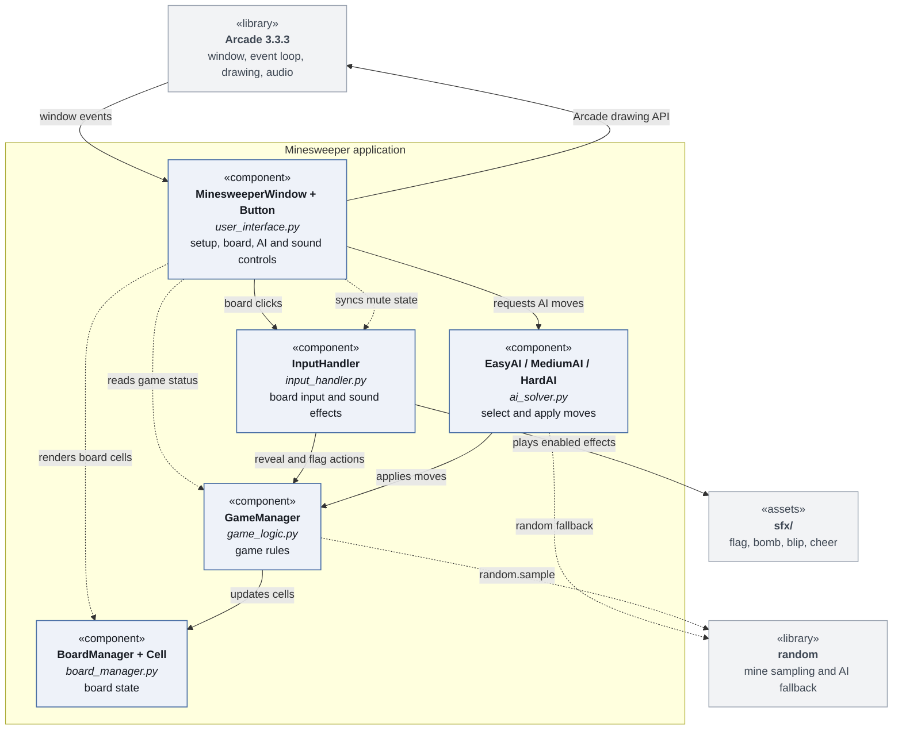
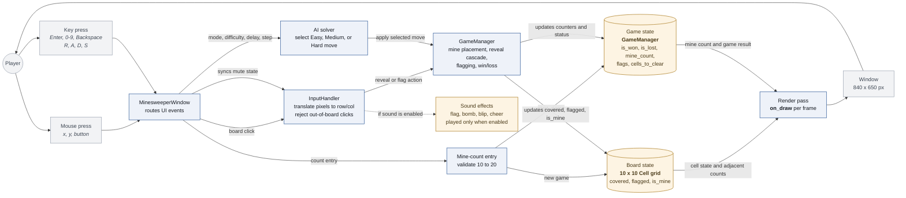
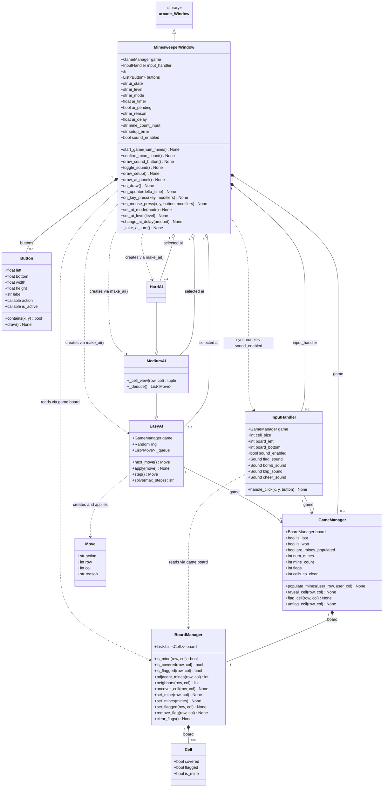

# EECS 581 Minesweeper

A desktop Minesweeper game written in Python with the [Arcade](https://api.arcade.academy/) library. It was built by a seven-person team for EECS 581 (Project 1) using Scrum-style sprints.

## Features

- In-game controls for selecting Off, Turn, or Auto AI mode and an Easy, Medium, or Hard AI difficulty
- 10x10 board with a player-selected mine count (10-20)
- Safe first click: mines are never placed on the first cell you reveal or its neighbors, so the first click always opens up some of the board
- Automatic clearing: revealing a cell with no adjacent mines uncovers its neighbors, and so on outward
- Right-click flagging, with a counter showing how many mines remain unflagged
- Adjacent-mine numbers in the standard Minesweeper colors
- A1-J10 style board labels (columns A-J, rows 1-10)
- Status indicator: `Playing`, `Victory`, or `Game Over: Loss`
- All mines are revealed on a loss
- Restart with the same mine count at any time
- Easy, Medium, and Hard AI solvers, with Off, Turn, and Auto modes, adjustable delay, and move explanations
- Sound effects for game actions, with a speaker button to mute or restore them

## Requirements

- Python 3.14 or newer
- [uv](https://docs.astral.sh/uv/) (recommended), or `pip`
- Arcade 3.3.3 or newer (installed automatically by `uv`)

## Setup and Running

Clone the repository, then from the project root:

```bash
uv sync
uv run src/user_interface.py
```

Without `uv`:

```bash
python -m venv .venv
source .venv/bin/activate      # Windows: .venv\Scripts\activate
pip install "arcade>=3.3.3"
python3 src/user_interface.py
```

## How to Play

1. Press `Enter` to activate mine-count entry. Type a number from 10 to 20 and press `Enter`; pressing `Enter` with nothing typed uses the default of 10. `Backspace` edits the entry.
2. Reveal cells with a left click. A number shows how many of the up to eight surrounding cells contain mines.
3. Flag suspected mines with a right click. Right-click a flag again to remove it. Flagged cells can't be revealed until the flag is removed.
4. Win by uncovering every cell that does not contain a mine. Lose by uncovering a mine.
5. Press `R` at any time to start a new game with the same mine count.
6. Use the AI panel to select Off, Turn, or Auto mode and an AI difficulty. Adjust the delay or take a single AI turn from the panel.
7. Click the speaker icon in the bottom-right corner to toggle sound effects.

| Input | Action |
| --- | --- |
| Left click | Reveal a cell |
| Right click | Place or remove a flag |
| `R` | Restart with the same mine count |
| Click AI mode or press `A` | Select Off, Turn, or Auto |
| Click AI difficulty or press `D` | Select Easy, Medium, or Hard |
| Click Slower/Faster | Adjust AI delay |
| Click Step or press `S` | Take one AI turn |
| Click speaker icon | Mute or restore sound effects |
| `Enter` before the game starts | Activate mine-count entry |
| `0`-`9`, `Backspace`, `Enter` | Enter the mine count |

Off mode lets you play alone. Turn mode gives the AI a turn after a player click. Auto mode lets the AI play continuously until the game ends.

Board clicks are ignored once the game has been won or lost.

## Project Structure

```
src/
├── ai_solver.py       # EasyAI, MediumAI, HardAI, and Move
├── board_manager.py   # Cell and BoardManager: the 10x10 grid and its cell state
├── game_logic.py      # GameManager: mine placement, reveal/flag rules, win/loss
├── input_handler.py   # InputHandler: board clicks and sound effects
└── user_interface.py  # Button and MinesweeperWindow: Arcade UI and controls
hours-tracking/        # Per-member hour logs and the team's hour estimates
meeting-notes/         # Scrum meeting notes
system-diagrams/       # Diagrams detailing system schematics
```

### Architecture

Gameplay input and game-state updates follow this flow:

```
Player input -> MinesweeperWindow -> InputHandler -> GameManager -> BoardManager -> MinesweeperWindow draws the board
AI controls -> selected AI solver -> GameManager -> BoardManager
```

- **`BoardManager`** owns the grid. Each `Cell` tracks whether it is covered, flagged, or a mine. The board provides `neighbors()` and `adjacent_mines()` helpers.
- **`GameManager`** owns the game rules: mine placement, revealing, flagging, and win/loss status.
- **`InputHandler`** translates board clicks into game actions and plays sound effects when enabled.
- **`EasyAI`, `MediumAI`, and `HardAI`** choose moves and apply them through `GameManager`; `Move` records the action and explanation.
- **`MinesweeperWindow`** creates the game and AI, draws the board and AI panel, handles keyboard and mouse events, and synchronizes the sound toggle with `InputHandler`.

The board size is set by `BOARD_SIZE` in `src/board_manager.py`. The UI layout constants (`CELL_SIZE`, `BOARD_LEFT`, and so on) are in `src/user_interface.py`. `InputHandler` currently hard-codes a 10x10 bounds check, so changing the board size requires updating it as well.

### Diagram of System Components

This diagram displays the system components of our minesweeper program.



### Data Flow

This diagram displays the dataflow of our minesweeper program.



### Key Data Structures

This diagram displays the key data structures of our minesweeper program.



## Team

| Member | Role |
| --- | --- |
| Luke Reicherter | Scrum Master |
| Drew Medlock | Board Manager / Game Logic Developer |
| Kyle Fleming | QA Tester and Bug Fixer |
| Alex Rawson | General Developer and Code Reviewer |
| Carter Steenhard | Game Logic / UI Developer |
| Blake Pennel | Lead UI Developer |
| Kyler Russell | General Developer and Code Reviewer |

## Group 5 Team Project 2

| Member | Role |
| --- | --- |
| John Vitha | UI Devlopment |
| Bill Grimsley | Documentation |
| Felix Balandran | Feature Additions |
| Abdulaziz Arab | AI Logic Developer |
| Jamareon Davis | AI Logic Developer |
| Riley Backus | AI Logic Developer |

## AI Usage

Some modules were drafted or revised with generative AI tools (ChatGPT and DeepSeek). Each source file's header documents which tool was used, why, and how the output was validated.

This README was written with the help of Claude (Anthropic's AI assistant, via Claude Code). Claude read the source files and project notes to draft it, and the team reviewed the result.
