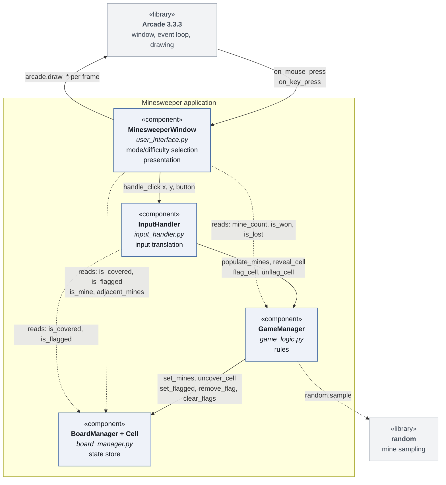
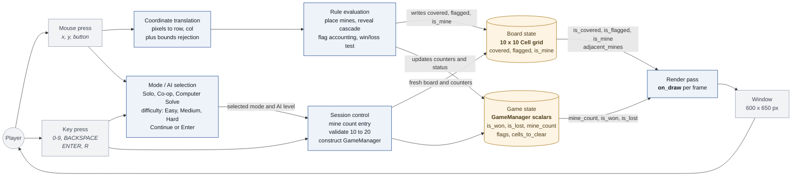
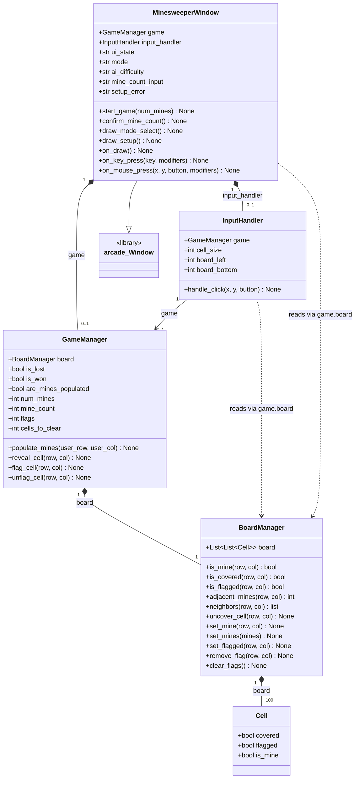

# EECS 581 Minesweeper

A desktop Minesweeper game written in Python with the [Arcade](https://api.arcade.academy/) library. It was built by a seven-person team for EECS 581 (Project 1) using Scrum-style sprints.

## Features

- Start screen for selecting Solo, Co-op, or Computer Solve mode and an Easy, Medium, or Hard computer difficulty
- Computer difficulty is currently a saved selection only; computer-play behavior is not implemented yet
- 10x10 board with a player-selected mine count (10-20)
- Safe first click: mines are never placed on the first cell you reveal or its neighbors, so the first click always opens up some of the board
- Automatic clearing: revealing a cell with no adjacent mines uncovers its neighbors, and so on outward
- Right-click flagging, with a counter showing how many mines remain unflagged
- Adjacent-mine numbers in the standard Minesweeper colors
- A1-J10 style board labels (columns A-J, rows 1-10)
- Status indicator: `Playing`, `Victory`, or `Game Over: Loss`
- All mines are revealed on a loss
- Restart with the same mine count at any time

## Requirements

- Python 3.14 or newer
- [uv](https://docs.astral.sh/uv/) (recommended), or `pip`
- Arcade 3.3.3 or newer (installed automatically by `uv`)

## Setup and Running

Clone the repository, then from the project root:

```bash
uv sync
uv run src/user_interface.py
```

Without `uv`:

```bash
python -m venv .venv
source .venv/bin/activate      # Windows: .venv\Scripts\activate
pip install "arcade>=3.3.3"
python3 src/user_interface.py
```

## How to Play

1. **Choose a game mode.** Select Solo, Co-op, or Computer Solve on the first screen. Select Easy, Medium, or Hard for computer difficulty, then click Continue or press `Enter`. 
2. **Choose a mine count.** Type a number from 10 to 20 and press `Enter`. Pressing `Enter` with nothing typed uses the default of 10. `Backspace` edits your entry.
3. **Reveal cells** with a left click. A number shows how many of the up to eight surrounding cells contain mines.
4. **Flag suspected mines** with a right click. Right-click a flag again to remove it. Flagged cells can't be revealed until the flag is removed.
5. **Win** by uncovering every cell that does not contain a mine. **Lose** by uncovering a mine.
6. Press `R` at any time to start a new game with the same mine count.

| Input | Action |
| --- | --- |
| Left click | Reveal a cell |
| Right click | Place or remove a flag |
| `R` | Restart with the same mine count |
| Click a mode or difficulty | Select game mode or computer difficulty |
| Click Continue or `Enter` | Advance from mode selection to mine-count setup |
| `0`-`9`, `Backspace`, `Enter` | Enter the mine count on the setup screen |

Clicks are ignored once the game has been won or lost.

## Project Structure

```
src/
├── board_manager.py   # Cell and BoardManager: the 10x10 grid and its cell state
├── game_logic.py      # GameManager: mine placement, reveal/flag rules, win/loss
├── input_handler.py   # InputHandler: converts mouse clicks to board actions
└── user_interface.py  # MinesweeperWindow: Arcade window, drawing, keyboard input
hours-tracking/        # Per-member hour logs and the team's hour estimates
meeting-notes/         # Scrum meeting notes
system-diagrams/       # Diagrams detailing system schematics
```

### Architecture

The code is split into four components with a one-way flow of control. The player first selects a mode and computer difficulty in the UI, then enters the mine count before gameplay begins:

```
Mode/difficulty selection -> mine-count setup -> MinesweeperWindow starts the game
Gameplay mouse click -> InputHandler -> GameManager -> BoardManager -> MinesweeperWindow draws the board
```

- **`BoardManager`** owns the grid. Each `Cell` tracks whether it is covered, flagged, and a mine. It also provides `neighbors()` and `adjacent_mines()` helpers. It contains no game rules.
- **`GameManager`** owns the rules: it places mines after the first click, handles reveal (including the recursive clear) and flagging, and tracks `is_won`, `is_lost`, and the remaining-mine count.
- **`InputHandler`** translates window coordinates into a row and column and calls the matching `GameManager` method.
- **`MinesweeperWindow`** stores the selected mode, computer difficulty, and current UI state; it draws the mode-selection and mine-count screens and the board, and handles mouse and keyboard events. The mode and difficulty are not yet connected to different gameplay behavior.

The board size is set by `BOARD_SIZE` in `src/board_manager.py`. The UI layout constants (`CELL_SIZE`, `BOARD_LEFT`, and so on) are in `src/user_interface.py`. Note that `InputHandler` currently hard-codes a 10x10 bounds check, so changing the board size requires updating it as well.

### Diagram of System Components

This diagram displays the system components of our minesweeper program.



### Data Flow

This diagram displays the dataflow of our minesweeper program.



### Key Data Structures

This diagram displays the key data structures of our minesweeper program.



## Team

| Member | Role |
| --- | --- |
| Luke Reicherter | Scrum Master |
| Drew Medlock | Board Manager / Game Logic Developer |
| Kyle Fleming | QA Tester and Bug Fixer |
| Alex Rawson | General Developer and Code Reviewer |
| Carter Steenhard | Game Logic / UI Developer |
| Blake Pennel | Lead UI Developer |
| Kyler Russell | General Developer and Code Reviewer |

## Group 5 Team Project 2

| Member | Role |
| --- | --- |
| John Vitha | UI Devlopment |
| Bill Grimsley | Documentation |
| Felix Balandran | Feature Additions |
| Abdulaziz Arab | AI Logic Developer |
| Jamareon Davis | AI Logic Developer |
| Riley Backus | AI Logic Developer |

## AI Usage

Some modules were drafted or revised with generative AI tools (ChatGPT and DeepSeek). Each source file's header documents which tool was used, why, and how the output was validated.

This README was written with the help of Claude (Anthropic's AI assistant, via Claude Code). Claude read the source files and project notes to draft it, and the team reviewed the result.
