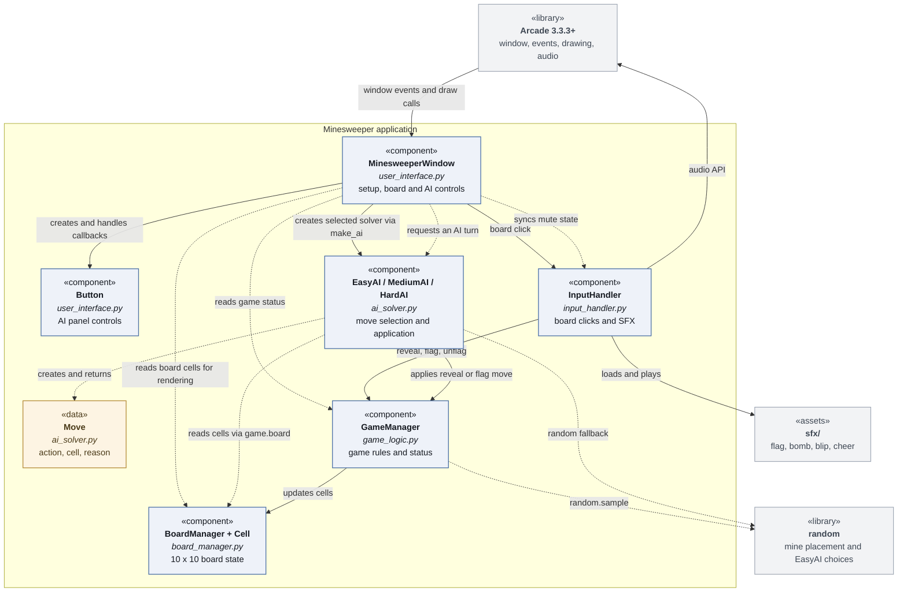
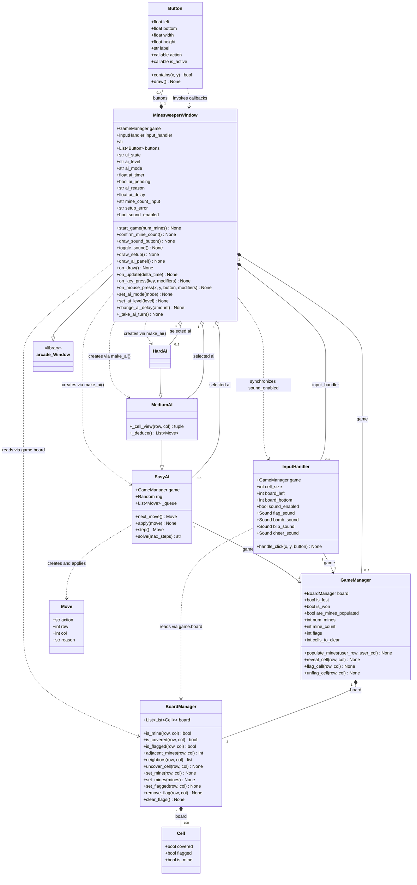

# Overview of Diagrams

This file contains the mermaid diagrams for the system components, data flow, and key data structures of our Minesweeper program. `Inf_mode.py` is intentionally excluded for now.
Attribution: These diagrams were created with the aid of Claude Opus 5, and then verified by Kyler Russell.

## Diagram of System Components

This diagram displays the system components of our Minesweeper program.

## Data Flow

This diagram displays the data flow of our Minesweeper program.

```mermaid
flowchart LR
    P(("Player"))

    KP["Keyboard<br/><i>Enter, 0-9, Backspace<br/>R, A, D, S</i>"]
    MP["Mouse<br/><i>board, AI controls<br/>sound button</i>"]
    UI["MinesweeperWindow<br/><b>Arcade event handling</b>"]
    SETUP["Mine-count entry<br/>validate 10 to 20<br/>blank Enter uses 10"]
    CREATE["start_game<br/>create GameManager,<br/>InputHandler and AI"]
    HIT["InputHandler<br/>pixels to row/column<br/>bounds check"]
    TOGGLE["Sound button click"]
    PANEL["AI controls<br/>mode, level, delay,<br/>single step"]
    AI["EasyAI / MediumAI / HardAI<br/>choose a Move"]
    RULES["GameManager<br/>mine placement, reveal cascade,<br/>flags and win/loss"]

    BS[("BoardManager<br/><b>10 x 10 Cell grid</b><br/>covered, flagged, is_mine")]
    GS[("Game state<br/><b>GameManager</b><br/>is_won, is_lost, mine_count,<br/>flags, cells_to_clear")]
    AUDIO["InputHandler SFX<br/>flag, bomb, blip, cheer"]
    RENDER["MinesweeperWindow.on_draw<br/>board, status, AI panel,<br/>sound button"]
    SCREEN["840 x 650 Arcade window"]

    P --> KP --> UI
    P --> MP --> UI
    UI -->|"Enter / count keys"| SETUP --> CREATE
    CREATE --> GS
    CREATE --> BS
    CREATE --> HIT
    CREATE --> AI

    UI -->|"board click"| HIT -->|"GameManager API"| RULES
    UI -->|"sound button click"| TOGGLE -->|"syncs mute state"| HIT
    UI -->|"mode, level, speed or step"| PANEL --> AI
    HIT -.->|"if enabled"| AUDIO
    RULES -->|"writes cells"| BS
    RULES -->|"updates counters and result"| GS
    AI -->|"Move: reveal or flag"| RULES
    RULES -->|"board and game state"| RENDER
    BS -->|"cell values and adjacent counts"| RENDER
    GS -->|"counter and game status"| RENDER
    RENDER --> SCREEN --> P

    classDef proc fill:#eef2f9,stroke:#4a6fa5,stroke-width:1.4px,color:#161a21
    classDef store fill:#fdf4e3,stroke:#b58b3a,stroke-width:1.4px,color:#4a3a18
    classDef io fill:#f2f3f5,stroke:#9aa3b0,stroke-width:1.2px,color:#3d4652
    class UI,SETUP,CREATE,HIT,TOGGLE,PANEL,AI,RULES,RENDER proc
    class BS,GS,AUDIO store
    class KP,MP,SCREEN,P io
```

## Key Data Structures

This diagram displays the key data structures of our Minesweeper program.

